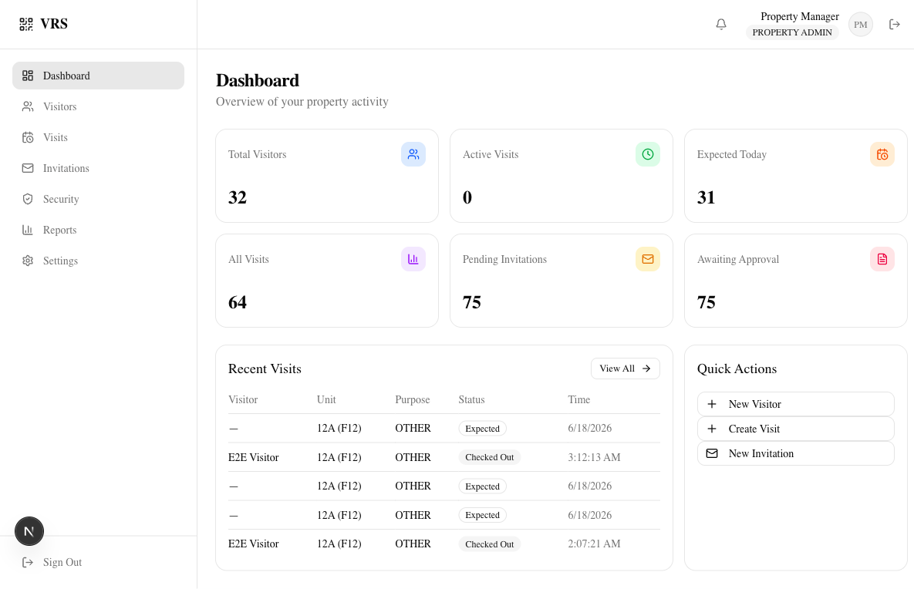
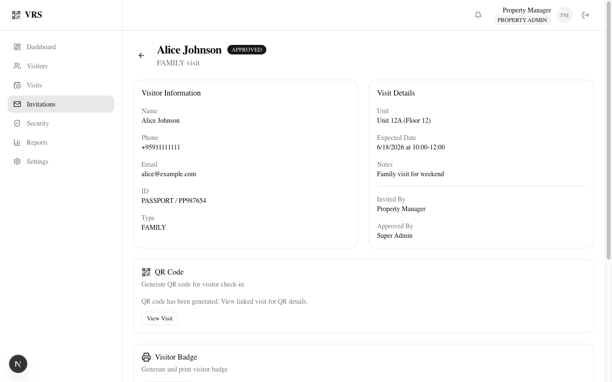
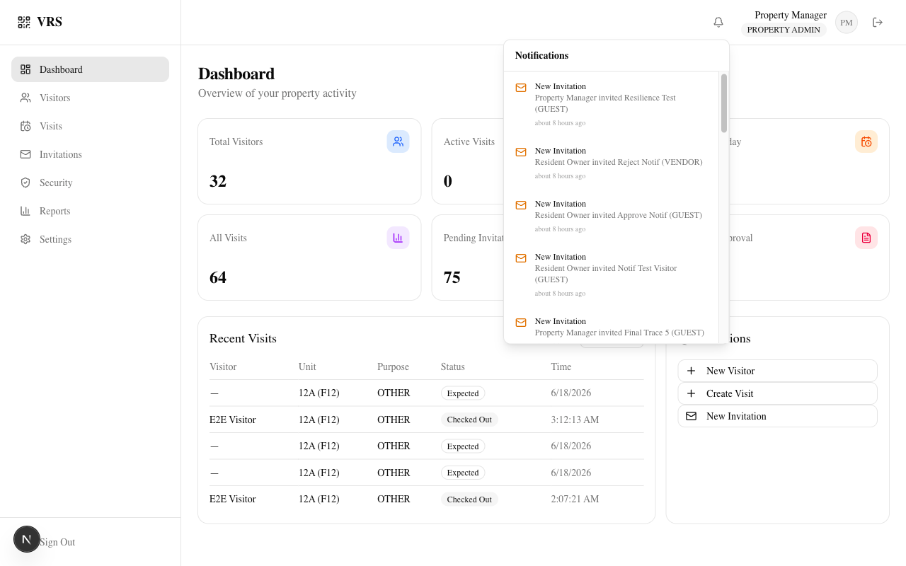

<p align="center">
  

  
  
  
</p>

<p align="center">
  
</p>

<h1 align="center">Visitor Registration System</h1>
<h3 align="center">QR-Based Digital Visitor Management</h3>
<p align="center">
  <em>Replace paper visitor logs with secure QR code check-in/check-out.<br>Built for condos, apartments, offices, and warehouses.</em>
</p>

<br>

---

## ✨ Features

<table>
  <tr>
    <td width="50%">
      <h3>🔐 Visitor Management</h3>
      <p>Register, search, edit, and soft-delete visitors. Complete CRUD with multi-property isolation.</p>
    </td>
    <td width="50%">
      <h3>📋 Visit Management</h3>
      <p>Create visits with visitor, unit, host, and purpose fields. Full lifecycle tracking.</p>
    </td>
  </tr>
  <tr>
    <td>
      <h3>🔳 QR Code Generation</h3>
      <p>Generate cryptographically secure, time-limited QR codes per visit with SHA-256 token hashing.</p>
    </td>
    <td>
      <h3>✅ QR Check-In / Check-Out</h3>
      <p>Validate QR tokens, check blocklists, record timestamps. Staff-initiated checkout with full audit trail.</p>
    </td>
  </tr>
  <tr>
    <td>
      <h3>📨 Invitation & Approval</h3>
      <p>Pre-register visitors. Approve or reject with reason. Automatic notification delivery to all stakeholders.</p>
    </td>
    <td>
      <h3>✉️ QR Email Delivery</h3>
      <p>Automatically email hosted QR access links after invitation QR generation, track delivery status, and support safe manual resend with cooldowns.</p>
    </td>
  </tr>
  <tr>
    <td>
      <h3>🔔 Notification Bell</h3>
      <p>Real-time in-app notification dropdown with unread badge. 7 event types across the invitation and visit lifecycle.</p>
    </td>
    <td>
      <h3>🛡️ Role-Based Access Control</h3>
      <p>Five roles: SUPER_ADMIN, PROPERTY_ADMIN, SECURITY_GUARD, RESIDENT, OFFICE_STAFF. Property-level data isolation.</p>
    </td>
  </tr>
  <tr>
    <td>
      <h3>📊 Audit Logging</h3>
      <p>20+ event types across all operations. IP address, user agent, and metadata tracked per event.</p>
    </td>
    <td>
      <h3>🚫 Visitor Blocklist</h3>
      <p>Block visitors by phone number or ID. Automatic check-in rejection for blocked visitors.</p>
    </td>
  </tr>
  <tr>
    <td>
      <h3>🏢 Multi-Property</h3>
      <p>Single system supports unlimited properties. Each with isolated users, units, visitors, and data.</p>
    </td>
    <td></td>
  </tr>
</table>

---

## 📸 Screenshots

<p align="center">
  
  
  
</p>

---

## 🛠️ Tech Stack

<p align="center">
  
  
  
  
  
  
  
  
  
  
  
</p>

---

## 🚀 Quick Start

```bash
# 1. Clone and install
git clone https://github.com/aungyephyo2215/vct-visitor-registration-system.git
cd visitor-registration-system
npm install

# 2. Copy environment
cp .env.example .env
# Edit .env — set JWT_SECRET and JWT_REFRESH_SECRET

# 3. Start PostgreSQL
docker compose up -d postgres

# 4. Run migrations and seed
npx prisma migrate deploy
npx prisma db seed

# 5. Start dev server
npm run dev
```

> Open **[http://localhost:3000](http://localhost:3000)** in your browser.

### 🔑 Default Accounts

| Email            |       Password | Role           |
| :--------------- | -------------: | :------------- |
| admin@vrs.com    |    `Admin123!` | SUPER_ADMIN    |
| property@vrs.com |    `Admin123!` | PROPERTY_ADMIN |
| guard@vrs.com    |    `Guard123!` | SECURITY_GUARD |
| resident@vrs.com | `Resident123!` | RESIDENT       |
| office@vrs.com   |   `Office123!` | OFFICE_STAFF   |

---

## 🐳 Docker Deployment

```bash
docker compose up --build -d
```

<table>
<tr><td>PostgreSQL</td><td><code>postgres:16-alpine</code> with healthcheck and named volume</td></tr>
<tr><td>Next.js App</td><td>Multi-stage build, standalone output, non-root user</td></tr>
<tr><td>Port</td><td><a href="http://localhost:3000">localhost:3000</a></td></tr>
</table>

---

## 📁 Project Structure

```
src/
├── app/
│   ├── (protected)/     # Dashboard, Visitors, Visits, Invitations, Security, Reports, Settings
│   ├── api/v1/          # REST API routes (auth, visitors, visits, invitations, QR, badges, notifications)
│   └── login/           # Login page
├── components/          # UI components (shadcn/ui + NotificationBell, StatusBadge, ConfirmDialog)
├── lib/                 # Business logic (auth, JWT, RBAC, validations, audit, notifications/)
├── hooks/               # React hooks
└── generated/prisma/    # Generated Prisma client
prisma/
├── schema.prisma        # 14 models, 16 enums, full index coverage
├── seed.ts              # Property, unit, 5 users, 2 invitations, 3 notifications
└── migrations/          # Versioned database migrations
tests/
├── e2e/                 # 33 Playwright tests (smoke, invitation, notification, RBAC, API, full-workflow)
└── helpers/             # Auth fixtures, test utilities
```

---

## 📚 Documentation

| Document                                            | Description                                                        |
| :-------------------------------------------------- | :----------------------------------------------------------------- |
| [Setup Guide](docs/setup.md)                        | Detailed installation, email provider, and QR resend configuration |
| [API Reference](docs/api.md)                        | Complete REST API documentation including QR email delivery        |
| [Release Notes](docs/releases/)                     | Version history and changelogs                                     |
| [Architecture](architecture/system-architecture.md) | System design and component architecture                           |
| [Database Schema](prisma/schema.prisma)             | Full data model with relations and indexes                         |

---

## 🧪 Testing

```bash
npm test                  # 147 unit tests (Vitest)
npm run test:watch        # Watch mode
npx playwright test       # 33 E2E tests (Playwright)
npm run check             # TypeScript + ESLint
```

| Suite                             | Count  | Status         |
| :-------------------------------- | ------ | :------------- |
| Unit Tests (`src/lib/__tests__/`) | 147    | ✅ Passing     |
| E2E Smoke                         | 8      | ✅ Passing     |
| E2E Invitation                    | 6      | ✅ Passing     |
| E2E Notification                  | 8      | ✅ Passing     |
| E2E RBAC                          | 5      | ✅ Passing     |
| E2E API                           | 2      | ✅ Passing     |
| E2E Full Workflow                 | 2      | ✅ Passing     |
| **Total E2E**                     | **33** | **✅ Passing** |

---

## 📊 CI/CD Pipeline

```
npm ci → lint → type check → unit tests → build
```

All gates must pass. Playwright E2E run locally (requires Docker PostgreSQL).

---

## 🗺️ Roadmap

| Phase         | Feature                         | Status         |
| :------------ | :------------------------------ | :------------- |
| Phase 1       | Core Visitor Management         | ✅ Complete    |
| Phase 2       | QR Workflow                     | ✅ Complete    |
| Phase 3       | Dashboard & Reports             | ✅ Complete    |
| Phase 4       | Universal Workflow Planning     | ✅ Complete    |
| Phase 5       | MVP Finalization                | ✅ Complete    |
| Phase 6       | Invitation & Approval Workflow  | ✅ Complete    |
| **Phase 6.5** | **QR Email Delivery**           | ✅ Implemented |
| Phase 7       | Self-Kiosk, Mobile QR Scanner   | 🔜 Upcoming    |
| Phase 8       | AI Analytics, Suspicious Alerts | 🔜 Upcoming    |

---

<p align="center">
  <sub>Built with ❤️ for secure, modern visitor management.</sub>
</p>
